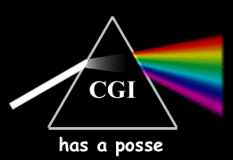

# Who's On First API Documentation

## Introduction

The Who's On First API allows developers (and robots) programmatic access to query and retrieve Who's On First data via a [REST-ish](#cgi) interface.

API methods are dispatched over `HTTP` with one or more query parameters and data is returned in response as [JSON](formats.md#json) by default but you may also specify [CSV](formats.md#csv) or Who's On First's own [meta](formats.md#meta) formatted responses for certain [API methods](methods.md).

All errors are returned using [HTTP status codes](errors.md) in the `400-599` range. `400` class errors mean the problem was your end and `500` class errors mean the problem was are our fault.

### Caveats

You should treat this API as though it were in "beta".

Which is to say: The point is for _the thing to work_ but there are probably still some rough edges and lingering gotchas so you should adjust your expectations and your code accordingly. In the meantime have at it and [please let us know](https://twitter.co/alloftheplaces) if something is busted or just doesn't feel right.

Also some methods are "more beta" than others. These methods are flagged as being `experimental` which means that both either their inputs or their outputs _may_ change without warning. We'll try not to introduce any backwards incompatible changes but you should approach these API methods defensively.

Finally the API is not feature complete yet. The easiest way to think about the Who's On First API is to look at the Who's On First [Spelunker]() website and imagine that anything you can do there to search and navigate all those places should also be possible via the API. As of this writing it is not but we'll get there. If there is anything currently missing that you'd like or need to do sooner than later [send up a flare](https://twitter.co/alloftheplaces) and we'll see about adding it to the list.

### Shout outs

Hugs and sloppy kisses to the [Common Gateway Interface](https://en.wikipedia.org/wiki/Common_Gateway_Interface).